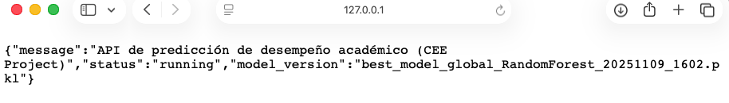
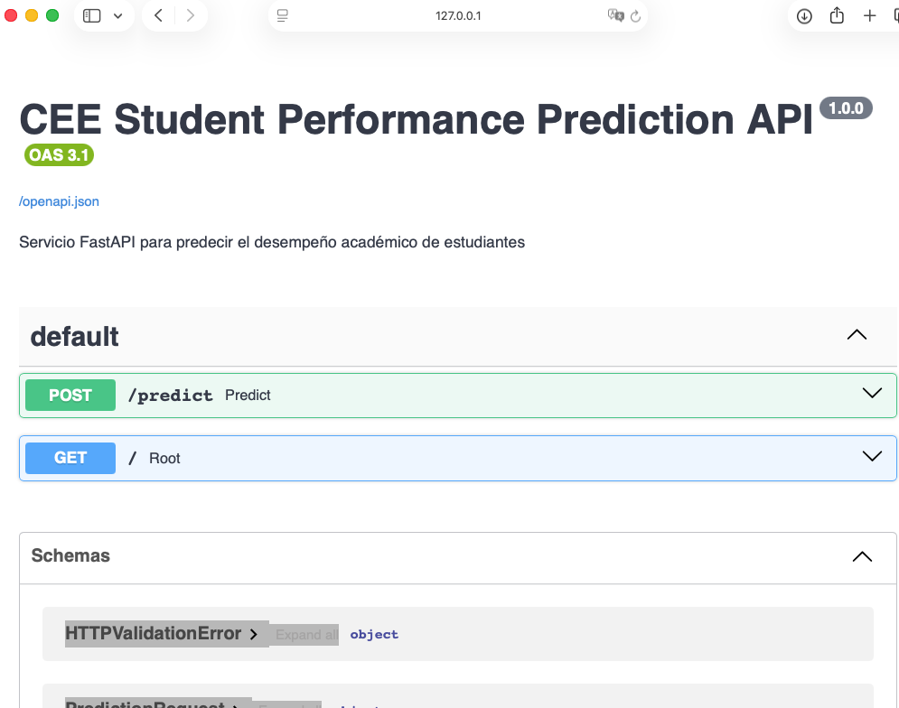

# API de Predicción con MLflow y FastAPI - Team 51

Documentación para Construcción y Uso de la Imagen Docker

---

## 📋 Descripción General

Este proyecto contiene una API REST desarrollada con **FastAPI** que sirve un modelo de Machine Learning para predecir calificaciones de estudiantes basándose en su edad y horas de estudio. El modelo está empaquetado en formato **MLflow** y se despliega mediante **Docker**.

## 📁 Estructura del Proyecto

```
docker/
├── Dockerfile                  # Definición de la imagen Docker
├── docker-requirements.txt     # Dependencias de Python para la API y para el modelo
├── README.md                   # Este archivo
├── api/
│   └── Team51_ML_API.py       # Código fuente de la API FastAPI (Hola Mundo)
└── model/                      # Modelo MLflow (artefactos)(Hola Mundo)
    ├── MLmodel
    ├── conda.yaml
    ├── python_env.yaml
    ├── requirements.txt
    └── registered_model_meta
```

## ⚙️ Requisitos Previos

- Docker instalado en su sistema (versión 20.10 o superior)
- Conexión a internet (para descargar dependencias e imágenes base de Dcoker)
- Puerto 8880 disponible en su máquina host

---

## 🔨 Opción 1: Construir la Imagen desde el Dockerfile

### Paso 1: Descarga el proyecto del repositorio remoto al local

```bash
git clone https://github.com/jjmoyap/test-MLops-CEE_DATA.git
```

### Paso 2: Construye la imagen Docker

```bash
docker build --no-cache -t ml-service-51 -f docker/Dockerfile .
```

**Parámetros:**
- `t` : Nombre de la imagen
- `f` : Indica que el Dockerfile está en el directorio __docker__

Nota:
- Debes estar posicionado en la raíz del proyecto 

⏱️ **Tiempo estimado:** 2-5 minutos (dependiendo de tu conexión a internet y tu computadora)

### Paso 3: Verificar que la imagen se creó correctamente

```bash
docker images | grep ml-service-51
```

Deberías ver algo como:
```
ml-service-51    latest    abc123def456    2 minutes ago    500MB
```

### Paso 4: Ejecutar el contenedor

```bashx
docker run \                                                   
  -p 8880:8880 \
  --name mi_contenedor \
  ml-service-51
```

**Parámetros:**
- `-p 8880:8880` : Mapea puerto 8880 del host al 8880 del contenedor
- `--name mi_contenedor` : Asigna nombre al contenedor
- `ml-service-51` : Imagen a utilizar

### Paso 5: Verificar que el contenedor está ejecutándose

```bash
docker ps
```

Deberías ver el contenedor en estado "Up"

---

## 🌐 Opción 2: Usar la Imagen Pública

### Paso 1: Descargar la imagen pública desde Docker Hub

```bash
docker pull c1544c/ml-service-51:latest
```

> **Nota:** La imagen pública está disponible en DockerHub `c1544c/ml-service-51-api`

### Paso 2: Ejecutar el contenedor desde la imagen pública

```bash
docker run \                                                   
  -p 8880:8880 \
  --name mi_contenedor \
  c1544c/ml-service-51:latest
```


## 🧪 Probar la API

### Opción A: Desde el navegador

#### 1. Navega a la siguiente URL
```
http://127.0.0.1:8880/
```
**Respuesta esperada:** 



#### 2. Documentación interactiva
```
http://127.0.0.1:8880/docs
```
Podrás probar todos los endpoints desde la interfaz **Swagger UI**



### Opción B: Desde la terminal con curl

#### 1. Health Check
```bash
curl http://127.0.0.1:8880
```
**Respuesta esperada:**
```json
{"message":"API de predicción de desempeño académico (CEE Project)","status":"running","model_version":"best_model_global_RandomForest_20251109_1602.pkl"}
```

#### 2. Predicción 
```bash
curl -X 'POST' \          
  'http://127.0.0.1:8880/predict' \
  -H 'accept: application/json' \
  -H 'Content-Type: application/json' \
  -d '{
  "data": {
    "Gender": "Male",
    "Caste": "OBC",
    "coaching": "Yes",
    "time": "1-2 Hours",
    "Class_ten_education": "CBSE",
    "twelve_education": "State Board",
    "medium": "English",
    "Father_occupation": "Private Service",
    "Mother_occupation": "Housewife",
    "Class_X_Percentage": "Good",
    "Class_XII_Percentage": "Vg"
  }
}'
```

**Respuesta esperada:**
```json
{"prediction":"0","probability":0.604190289821873,"model_version":"best_model_global_RandomForest_20251109_1602.pkl"}
```


### Opción C: Desde Python

```python
url = "http://127.0.0.1:8880/predict"

headers = {
    "accept": "application/json",
    "Content-Type": "application/json"
}

payload = {
    "data": {
        "Gender": "Male",
        "Caste": "OBC",
        "coaching": "Yes",
        "time": "1-2 Hours",
        "Class_ten_education": "CBSE",
        "twelve_education": "State Board",
        "medium": "English",
        "Father_occupation": "Private Service",
        "Mother_occupation": "Housewife",
        "Class_X_Percentage": "Good",
        "Class_XII_Percentage": "Vg"
    }
}

response = requests.post(url, json=payload, headers=headers)

print("Status:", response.status_code)
print("Response JSON:")
print(response.json())

```

---

## 🛠️ Gestión del Contenedor

### Detener el contenedor
```bash
docker stop mi_contenedor
```

### Iniciar el contenedor detenido
```bash
docker start mi_contenedor
```

### Reiniciar el contenedor
```bash
docker restart mi_contenedor
```

### Ver logs en tiempo real
```bash
docker logs -f mi_contenedor
```

### Ejecutar comandos dentro del contenedor
```bash
docker exec -it mi_contenedor /bin/bash
```

### Eliminar el contenedor
```bash
docker rm -f mi_contenedor
```

### Eliminar la imagen
```bash
docker rmi mi_contenedor
```

### Ver estadísticas de uso del contenedor
```bash
docker stats mi_contenedor
```

---

## 🐛 Solución de Problemas

### Problema: El contenedor no inicia

**Solución 1:** Verificar logs
```bash
docker logs mi_contenedor
```

**Solución 2:** Verificar que el puerto 8880 no esté en uso
```bash
# macOS/Linux
lsof -i :8880

# Windows
netstat -ano | findstr :8880
```

**Solución 3:** Verificar que los archivos del modelo existen
```bash
ls -la model/
```

### Problema: La API responde lento

**Solución:** Asignar más recursos al contenedor Docker
```bash
docker run -d \
  --name team51-api-container \
  --memory="2g" \
  --cpus="2.0" \
  -p 8880:8880 \
  --name mi_contenedor \
  team51-api:latest
```

### Problema: No puedo conectarme a la API desde fuera del host

**Solución:** Verificar que el puerto está mapeado correctamente
```bash
docker ps  # Verifica que aparezca 0.0.0.0:8880->8880/tcp
```

### Problema: Error al instalar dependencias durante la construcción

**Solución 1:** Limpiar la caché de Docker
```bash
docker builder prune
```

**Solución 2:** Construir sin caché
```bash
docker build --no-cache -t team51-api:latest .
```

---

## 🏗️ Arquitectura del Proyecto

### Flujo de ejecución:

1. Dockerfile copia el modelo y el código de la API al contenedor
2. Se instalan las dependencias de Python
3. Se crea un usuario no-root para seguridad
4. Uvicorn inicia el servidor FastAPI en el puerto 8880
5. MLflow carga el modelo desde `/ml/model`
6. La API queda lista para recibir peticiones

### Endpoints disponibles:

| Método | Endpoint | Descripción |
|--------|----------|-------------|
| `GET` | `/` | Mensaje de bienvenida |
| `GET` | `/docs` | Documentación interactiva Swagger |
| `POST` | `/open` | Predicción para un estudiante |
| `POST` | `/predict` | Modelo de predicción |


## ✨ Mejores Prácticas

### 1. Seguridad:
- ✅ La imagen ejecuta el servicio con usuario no-root (`team51`)
- ✅ No incluir credenciales en el Dockerfile
- ✅ Usar variables de entorno para configuración sensible

### 2. Optimización:
- ✅ Usar imágenes base slim para reducir el tamaño
- ✅ Multi-stage builds si el proyecto crece
- ✅ Aprovechar la caché de Docker organizando comandos correctamente

### 3. Monitoreo:
- ✅ Implementar health checks
- ✅ Centralizar logs
- ✅ Usar herramientas de monitoreo (Prometheus, Grafana)

### 4. CI/CD:
- ✅ Automatizar construcción de imágenes
- ✅ Versionar las imágenes (tags semánticos)
- ✅ Ejecutar pruebas antes de publicar

---

## 📚 Recursos Adicionales

### Documentación oficial:
- [Docker](https://docs.docker.com/)
- [FastAPI](https://fastapi.tiangolo.com/)
- [MLflow](https://www.mlflow.org/docs/latest/index.html)
- [Uvicorn](https://www.uvicorn.org/)

### Tutoriales recomendados:
- [Docker para principiantes](https://docker-curriculum.com/)
- [FastAPI tutorial](https://fastapi.tiangolo.com/tutorial/)
- [MLflow tracking](https://www.mlflow.org/docs/latest/tracking.html)

---

## 👥 Contacto y Soporte

- **Equipo:** Team 51
- **Proyecto:** MLOps - Sistema de Predicción de Calificaciones
- **Repositorio:** test-MLops-CEE_DATA
- **Imagen Docker Hub:** [c1544c/team51-api](https://hub.docker.com/r/c1544c/team51-api)

Para reportar problemas o sugerencias, por favor crear un issue en el repositorio.

---

## 📝 Changelog

### Versión 1.1.0 (15 de noviembre de 2025)

- ✨ Implementación inicial de la API con FastAPI
- 🐳 Dockerización del servicio
- 📊 Endpoints de predicción
- 📖 Documentación completa

---

## 📄 Licencia

Este proyecto es parte del curso de MLOps - Team 51

---

**¡Gracias por usar nuestra API! 🚀**
